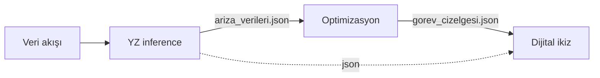

Güneş enerjisi santralinde arızayı görmek çoğu zaman işin sonu gibi düşünülür. Sahada paneller termal kamerayla taranır, bir ısınma noktası bulunur ve kayıt açılır. Fakat o kaydın ne zaman ele alınacağı, hangi ekibe verileceği ve beklemenin neye mal olacağı hâlâ belirsizdir.

Bu projede termal görüntüden bakım rotasına kadar uzanan bir karar destek sistemi kurdum. Sistem üç arıza sınıfını tespit ediyor; bakım kararını maliyet ve kapasiteye göre veriyor; seçilen işleri ekiplere dağıtıyor. Mimariyi kurarken asıl uğraştığım nokta, bu adımların ayrı ayrı çalışması değil, birbirlerine güvenilir veri bırakmasıydı.

## Neden Tespit Tek Başına Yetmiyor?

Bir GES sahası yüzlerce hatta binlerce panele yayılır. Hotspot yangın riski taşırken mikro çatlak zamanla büyüyebilir. Tozlanma ise daha düşük öncelikli görünmesine rağmen verimi düzenli olarak azaltır. Bu arızaların hepsini aynı öncelikle ele almak, sınırlı bakım kapasitesini yanlış kullanmak demektir.

Bu nedenle modelin bir panelin çevresine kutu çizmesi yeterli değildi. Çıktıda panel kimliği, arıza türü, güven skoru ve konum bilgisi de bulunmalıydı. Optimizasyon ancak bu bilgilerle hangi arızanın bekleyebileceğini hesaplayabiliyor.

<Callout label="Ana fikir">
Tespit çıktısını doğrudan görev listesi saymadım. Araya maliyet, güvenlik ve ekip kapasitesini değerlendiren ayrı bir karar katmanı koydum.
</Callout>

## Dört Katmanlı Gevşek Bağlı Mimari

İlk taslakta modüllerin sınırları net değildi. Görüntü okuma, tahmin ve arayüz kodu aynı akış içinde ilerliyordu; model olmadan optimizasyonu denemek zorlaşıyordu. Bunun üzerine sistemi dört bağımsız modüle ayırdım. Modüller API veya paylaşılan bellek yerine JSON dosyalarıyla haberleşiyor.

Veri katmanı, senaryoya ait görüntüleri ve meta veriyi sırayla besliyor. Donanım hesabında DJI Matrice 350 RTK ile Zenmuse H20T’yi referans aldım. Kameranın termal çözünürlüğü 640×512; yaklaşık 20 metre irtifada hesapladığım yer örnekleme mesafesi 2,5 cm/piksel. Prototip gerçek uçuş yapmıyor, bu akışı kayıtlı görüntülerle simüle ediyor.

YOLO26s tahminleri `ariza_verileri.json` dosyasına yazılıyor. Optimizasyon modülü bu dosyayı okuyup MILP ile bakım seçimini, CVRP ile ekip rotalarını üretiyor. Sonuç `gorev_cizelgesi.json` olarak PyQt6 arayüzüne ulaşıyor. Bu sınır sayesinde modeli çalıştırmadan sentetik bir arıza dosyasıyla çözücüyü test edebildim; arayüzü de optimizasyon koduna dokunmadan geliştirdim.

## YOLO26: Ne Kadar Doğru Tespit Ediyoruz?

Model olarak YOLO26s seçtim. Roboflow’daki SOLAR PANEL DET veri setinde 15 sınıf vardı; bunları projeye uygun üç sınıfa indirdim: `hotspot`, `mikro_catlak`, `tozlanma`. Eğitimi yerel GPU’da 70 epoch, batch 16, 640 px giriş boyutuyla yaptım.

Yerel eğitim beklediğimden daha yorucu oldu. VRAM’in dolması ve termal darboğaz yüzünden bazı denemeler yarıda kaldı. Tamamlanan 70 epoch yaklaşık iki buçuk saat sürdü; daha uzun bir koşu yerine veri artırmayı hafif tutarak kararlı bir eğitim almaya çalıştım. Sonuç ekranında ilk baktığım sayı genel mAP oldu ve açıkçası daha yüksek bir değer bekliyordum.

*Eğitim kayıpları düzenli azalırken mAP değerleri son epoch’larda plato yapıyor. Doğrulama sınıflandırma kaybındaki hafif yükseliş, zayıf sınıflardaki genelleme sınırına işaret ediyor.*

| Sınıf | mAP@0.5 | Precision | Recall |
| --- | ---: | ---: | ---: |
| Hotspot | %80.5 | %70.1 | %81.1 |
| Mikro çatlak | %31.9 | %44.3 | %31.7 |
| Tozlanma | %21.7 | %36.4 | %22.8 |

Genel mAP@0.5 yaklaşık 0,447, mAP@0.5:0.95 ise 0,316 çıktı. Sınıf tablosu daha açıklayıcıydı. Hotspot’ın belirgin termal imzası modeli %80,5 mAP@0.5 seviyesine taşırken mikro çatlakların ince çizgileri 640 piksele küçültüldüğünde kayboluyordu. Tozlanma da termal görüntüden çok RGB ipuçlarına ihtiyaç duyuyordu. Bu ayrım, düşük genel ortalamaya rağmen kritik güvenlik sınıfında kullanılabilir bir sonuç elde ettiğimi gösterdi.

## MILP ile Seç, CVRP ile Rotala

Optimizasyon iki aşamalı. Önce aynı paneldeki çoklu tespitleri tek hasara indirgiyorum. Sonra her panel için ikili karar veriyorum: bugün tamir et ($x_i=1$) ya da ertele ($x_i=0$).

$$
\min \sum_{i \in P} \big[ x_i \cdot M_i + (1-x_i) \cdot O_i \big]
$$

$M_i$ bakım maliyeti; $O_i$ ise 30 günlük fırsat maliyeti (üretilmeyen enerjinin parasal karşılığı). Hotspot ve mikro çatlak güvenlik nedeniyle zorunlu (`must_fix`). Tozlanma ekonomik değilse ertelenir. Kapasite kısıtı da net: toplam servis süresi $\le$ 3 ekip × 480 dakika.

Seçilen paneller ikinci aşamada kapasiteli araç rotalama problemine (CVRP) giriyor. PuLP ve CBC ile yakıt maliyetini minimize ederken her ekibin günlük mesaisini koruyorum. MTZ kısıtları, deponun dışında kendi içinde dönen geçersiz alt turları engelliyor. Çözücü 60 saniye içinde sonuç vermezse kapasiteyi gözeten en yakın komşu sezgiseli devreye giriyor.

Üç senaryo çözücünün farklı kararlarını görünür kıldı. Hafif tozlanma içeren A senaryosunda görev listesi boş kaldı; 30 günlük kayıp, bakım maliyetini karşılamıyordu. B’de iki hotspot zorunlu bakıma alındı. C’de ise on mikro çatlağın toplam 600 dakikalık işi üç ekibe paylaştırıldı.

## Senaryo Tasarrufu ve Yıllık ROI

Tek bakım turunu run-to-failure ve periyodik bakımla karşılaştırdığımda tespit süresi saatler mertebesine indi; B ve C senaryolarındaki enerji kaybı da belirgin biçimde azaldı. İlk rapor taslağında bu sonuçları tek bir “tasarruf” yüzdesi altında toplamıştım. Hesabın bileşenlerini ayırınca bunun savunulamayacağını gördüm.

*Otonom sistemin tespit ve müdahale süresi, senaryonun servis yüküne göre 1–11 saat arasında değişiyor.*

Operasyonel hız ve enerji kaybı iddiaları ölçülebilir ve sağlam. Malzeme tasarrufundaki yaklaşık %50’lik kısım ise “RTF’te panellerin %70’i, otonomda %30’u değişir” varsayımına dayanıyor; saha kalibrasyonuyla bu %20–25’e inebilir. Senaryo A’daki “%100 tasarruf” da sahte bir yüzde: bakım yapmadığım için maliyet sıfır. Doğru yorum, ekonomik olmayan işi engellediğim.

*Enerji kaybı değerleri senaryo modelinden hesaplandı; gerçek saha ölçümü değil.*

Yıllık hesap daha anlamlı bir ölçek sundu. Tipik 10 MW santral için geleneksel bakım maliyetini yaklaşık 500.000 TL/yıl kabul ettim. Donanım ve yazılım yatırımı beş yıla yayıldığında otonom sistem yaklaşık 250.000 TL/yıl maliyete geliyor. Bu varsayımlarla net kazanç yılda 250.000 TL, geri ödeme süresi iki yıl. Karamsar senaryoda süre yaklaşık dört yıla uzuyor.

## Sonuç

Prototipin sonunda elimde yalnızca arıza kutuları çizen bir model yoktu. Görüntüden çıkan kayıt, maliyet ve kapasite kısıtlarından geçiyor; ardından haritada uygulanabilir bir bakım planına dönüşüyordu. Dört modülü JSON sözleşmeleriyle ayırmak bu zinciri parça parça sınamamı sağladı.

Modelin mikro çatlak ve tozlanma performansı henüz saha kullanımı için yeterli değil. Buna karşılık hotspot sonuçları ile optimizasyon senaryoları, yaklaşımın nerede çalıştığını ve nerede yeni veriye ihtiyaç duyduğunu açıkça gösteriyor. Bundan sonraki iki iş de bu yüzden belli: eğitimi daha güçlü donanımda sürdürmek ve ROI hesabındaki panel değişim oranlarını saha verisiyle kalibre etmek.
