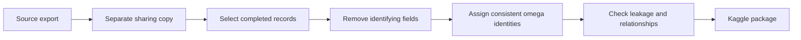

Publishing a dataset initially looked like a matter of uploading a few CSV files. I had session-level summaries, more than 1.16 million time-series points, and a table of transfer events. They were ready for analysis, but they also contained real streamer names, links, stream titles, and identifiers from the source system. Removing those fields was the first step, not the last one.

Preparing a separate Kaggle package meant preserving two goals at once: no output should point directly to an individual, and the analytical relationships among the three tables should remain intact. The process showed me that anonymization is more than renaming people. A brand name hidden inside a category, records left behind by early tests, and one stream collected at the wrong resolution only became visible when I treated validation as part of the transformation.

## Sharing Started with a Copy

My first decision was not to clean the working export in place. I copied `streams.csv`, `timeseries.csv`, and `stream_events.csv` into a separate directory and applied every transformation to that sharing copy. If the anonymizer made a mistake, it would not irreversibly alter the source output I still used for analysis.

That boundary also clarified the role of each dataset. The source export was the operational result of the collection pipeline. The Kaggle package was a derived product governed by a specific publication policy. I kept only completed sessions in the derived version. Publishing rows marked `scraping` or `skipped` could mislead a reader who had no context for why their details were incomplete.

Rather than editing three files manually, I put the transformation in a repeatable Python script. It reads the source CSVs, selects publishable columns, creates aliases in memory, and writes all three outputs. I deliberately did not save the mapping table. A dictionary connecting real names to aliases would make the anonymization much easier to reverse.

## Removing Identity Without Destroying Relationships

The simplest anonymization would have dropped every identity-related column. Removing `streamer`, however, would also prevent analysts from grouping multiple sessions from the same creator. I instead sorted the 51 source streamers and assigned stable aliases from `omega_1` through `omega_51`. Only 49 had completed sessions in the final package, but an alias still represented the same person across all three files.

I was stricter with fields that provided a direct path back to the source. Platform names, stream URLs, external identifiers, and stream titles disappeared entirely. Event labels in the form `Hosted by …` contained usernames outside the original target list, so replacing only the main streamer names was not enough. I removed the label column while preserving direction through `host` and `outgoing_host`, and event magnitude through `value`.

The files remain joinable through a local `stream_id`, not an identifier from the source service. This key describes a session only inside the published dataset. A reader can connect a session summary to its time series and events, but cannot use that key to navigate back to the original page.

<Callout label="The balance">
  Useful anonymization does not erase all context. It cuts identity links to the
  outside world while preserving the internal relationships required for analysis.
</Callout>

## “Complete” Did Not Always Mean “High Quality”

The first validation failure came from an unexpected place: a category value still contained the platform brand. Removing the platform column and URLs did not make every text field neutral. I scanned category values as well and replaced the brand term with a generic label. Free-text fields turned out to be easier to overlook than obvious identifier columns.

The export also contained a target left over from early development tests. I removed those rows from both the summary and time-series files. A more important quality problem appeared in a session marked as complete. The expected audience series advanced at roughly 30-second intervals, but this record moved mostly in ten-minute steps. A session lasting 23 hours and 50 minutes was represented by only 53 points. Its `done` status did not make it comparable to the rest of the dataset.

Comparing the raw response with the CSV confirmed that normal audience points arrived on a 30-second grid, while chat metrics arrived every 60 seconds. The parser attached chat values to the nearest audience point, so empty chat cells on some 30-second rows were expected. The ten-minute record was different and was removed from both packages.

## Cleaning Needs Tests, Not Just Judgment

The final package contained 1,397 sessions, 1,168,867 time-series points, and 2,708 events. Those totals were not proof of correctness, so I added automated checks to the end of the transformation. Every `streamer` value had to match the `omega_N` pattern, forbidden brand and link patterns had to be absent from every cell, and every `stream_id` in the time-series and event files needed a matching row in the session table.

The brand term hidden in a category demonstrated why validation should inspect values rather than only column names. I also wrote an English README that records row counts, schemas, and column meanings. A reader can tell which fields contain seconds, timestamps, or event magnitude without opening the transformation code.

The process exposed one remaining weakness: I initially removed the low-resolution session manually. If the transformation script runs again before that quality rule is encoded, the record can return. Producing the right result once is not the same as making it reproducible. The durable fix is a general rule that rejects sessions whose sampling interval deviates substantially from the expected resolution, without hard-coding a person or a particular `stream_id`.

## Conclusion

The hardest part of preparing the Kaggle package was deciding what should remain, not choosing a file format. Aliases removed visible identities, scanning free text caught indirect traces, and the local `stream_id` kept three tables useful for analysis. Checking temporal resolution prevented an anonymous but incomparable session from entering the final dataset.

The result is not merely a smaller copy of the source export. It is a data product with explicit publication rules. My next step is to move the last manual quality decision into a general sampling check in the script. A package regenerated tomorrow should then preserve the same anonymity and quality boundaries without relying on someone remembering the exception.
