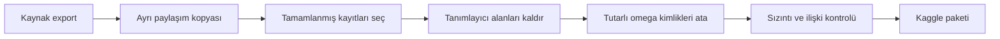

Bir veri setini paylaşmak, birkaç CSV’yi yüklemekten ibaret görünüyordu. Elimde yayın düzeyinde özetler, 1,16 milyondan fazla zaman serisi noktası ve olay kayıtları vardı. Dosyalar analiz için hazırdı; fakat gerçek yayıncı adları, bağlantılar, yayın başlıkları ve dış sistem kimlikleri de aynı tablolarda duruyordu. Bunları silmek ilk adımdı, son adım değil.

Kaggle için ayrı bir paket hazırlarken iki hedefi birlikte korumam gerekti: hiç kimseyi doğrudan işaret etmeyen bir çıktı üretmek ve üç tablo arasındaki analitik ilişkileri bozmamak. Süreç, anonimleştirmenin yalnızca isim değiştirmek olmadığını gösterdi. Gizli kalmış marka ifadeleri, test artıkları ve yanlış çözünürlükte toplanmış bir yayın ancak sistematik doğrulamada ortaya çıktı.

## Paylaşım Kopyadan Başladı

İlk kararım, temizliği mevcut export dosyalarında yapmamak oldu. Çalışan veri hattının ürettiği `streams.csv`, `timeseries.csv` ve `stream_events.csv` dosyalarını ayrı bir klasöre kopyaladım. Bundan sonraki bütün dönüşümler paylaşım kopyasında ilerledi. Böylece bir anonimleştirme hatası, analiz için sakladığım kaynak çıktıyı geri dönüşsüz biçimde değiştirmeyecekti.

Bu ayrım küçük görünse de veri hazırlamanın sınırını netleştirdi. Kaynak export, sistemin ürettiği operasyonel sonuçtu; Kaggle paketi ise belirli bir paylaşım politikasına göre hazırlanmış türev bir üründü. Türev üründe yalnızca tamamlanmış yayınları tuttum. `scraping` veya `skipped` durumundaki kayıtları yayımlamak, neden eksik olduklarını bilmeyen okuyucu için yanıltıcı olabilirdi.

Dönüşümü elle düzenlenen birkaç dosyaya bırakmak yerine tekrar çalıştırılabilir bir Python scriptine taşıdım. Script kaynak CSV’leri okuyor, paylaşılabilir kolonları seçiyor, yayıncı eşlemesini bellekte kuruyor ve üç çıktıyı yeniden yazıyordu. Eşleme tablosunu ayrıca kaydetmedim; çünkü gerçek isim ile takma ad arasındaki sözlük, anonimleştirmenin tersine çevrilmesini kolaylaştıracaktı.

## Kimliği Silerken İlişkileri Korumak

Anonimleştirmede kolay yol, kimlik içeren her kolonu silmekti. Fakat `streamer` alanını tamamen kaldırırsam aynı yayıncıya ait farklı oturumları birlikte incelemek mümkün olmayacaktı. Bu nedenle 51 kaynak yayıncıyı alfabetik sırayla `omega_1` ile `omega_51` arasındaki kararlı takma adlara eşledim. Yalnızca tamamlanmış oturumları olan 49 yayıncı son pakette görünse de aynı takma ad üç dosyada da aynı kişiyi temsil ediyordu.

Doğrudan iz bırakabilecek alanlarda daha katı davrandım. Platform adı, yayın URL’si, dış sistem kimliği ve yayın başlığı çıktıdan tamamen çıkarıldı. Olay tablosundaki `Hosted by …` biçimindeki etiketler, hedef listesinde bulunmayan başka kullanıcı adları taşıdığı için yalnızca ana yayıncıyı değiştirmek yeterli değildi. Etiket kolonunu kaldırdım; yön bilgisini zaten `host` ve `outgoing_host`, olay büyüklüğünü ise `value` koruyordu.

Tablolar arası bağı gerçek dünyaya ait dış kimliklerle değil, yerel `stream_id` ile sürdürdüm. Bu anahtar yalnızca veri seti içindeki oturumu gösteriyor. Böylece bir okuyucu özet tabloyu zaman serisi ve olaylarla birleştirebiliyor, fakat bu anahtardan kaynak sayfaya ulaşamıyor.

<Callout label="Temel denge">
  İyi bir anonimleştirme, bütün bağlamı yok etmez. Dışarıya açılan kimlik bağlarını
  keserken analizin ihtiyaç duyduğu iç ilişkileri korur.
</Callout>

## “Tamamlandı” Her Zaman “Kaliteli” Demek Değildi

İlk doğrulama, beklemediğim bir yerde durdu: kategori kolonunda platform markasını içeren bir etiket kalmıştı. Platform kolonunu ve URL’leri silmiş olmam, metin alanlarının temiz olduğu anlamına gelmiyordu. Kategori değerlerini de tarayıp marka sözcüğünü nötr bir ifadeyle değiştirdim. Bu olay, serbest metin kolonlarının yapısal kimlik alanlarından daha kolay gözden kaçabildiğini gösterdi.

Erken geliştirme testlerinden kalan bir hedef de export içinde duruyordu. Aktif hedef listesine ait olmayan bu kayıtları hem özet hem zaman serisi dosyasından çıkardım. Daha önemli kalite sorunu ise tamamlanmış görünen bir yayında ortaya çıktı. Beklenen izleyici serisi yaklaşık 30 saniyelik aralıklara sahipken bu kayıtta noktalar çoğunlukla 10 dakika arayla ilerliyordu. 23 saat 50 dakikalık yayın yalnızca 53 noktayla temsil edilmişti; etiketinde `done` yazması bu veriyi karşılaştırılabilir yapmıyordu.

Ham yanıt ile CSV’yi yan yana kontrol ettiğimde normal yayınlarda izleyici serisinin 30 saniyelik, sohbet serisinin ise 60 saniyelik ızgarada geldiğini doğruladım. Scraper sohbet değerlerini en yakın izleyici noktasına bağlıyordu; bu nedenle bazı 30 saniyelik satırlarda sohbet alanlarının boş olması normaldi. On dakikalık kayıt ise farklıydı ve iki paketten de çıkarıldı.

## Temizlik Test Edilebilir Olmalı

Son paket 1.397 yayın oturumu, 1.168.867 zaman serisi noktası ve 2.708 olay kaydı içeriyordu. Bu sayıların tek başına güvence olmadığını bildiğim için dönüşümün sonuna otomatik kontroller ekledim. Her `streamer` değeri `omega_N` kalıbına uymalı, yasaklı marka ve bağlantı kalıpları hiçbir hücrede görünmemeli, zaman serisi ile olay tablolarındaki bütün `stream_id` değerleri özet tabloda karşılık bulmalıydı.

Doğrulamanın kategori içindeki marka adını yakalaması, kontrolün yalnızca kolon başlıklarına bakmaması gerektiğini kanıtladı. Aynı şekilde dosyaların satır sayılarını ve şemalarını belgeleyen İngilizce bir README hazırladım. Okuyucu hangi alanın saniye, hangisinin zaman damgası, hangisinin olay büyüklüğü olduğunu kaynak kodu açmadan görebiliyordu.

Burada süreçte kalan bir pürüz de görünür oldu: düşük çözünürlüklü yayını önce elle sildim. Dönüşüm scripti yeniden çalıştırılırsa aynı kalite kuralı koda taşınmadığı sürece kayıt geri gelebilir. Bir temizliğin bir kez doğru sonuç vermesi ile tekrar üretilebilir olması aynı şey değil. Kalıcı çözüm, “beklenen çözünürlükten belirgin biçimde sapan yayını reddet” kuralını kişisel bir kimliğe veya belirli bir `stream_id` değerine bağlamadan dönüşüm aşamasına eklemek.

## Sonuç

Kaggle paketini hazırlarken en çok zamanı dosya biçimi değil, hangi bilginin kalacağı aldı. Yayıncıları takma adlarla değiştirmek görünür kimliği kaldırdı; serbest metin taraması dolaylı izleri yakaladı; `stream_id` ise üç tabloyu analiz edilebilir tuttu. Zaman çözünürlüğünü kontrol etmek de anonim fakat karşılaştırılamaz bir kaydın veri setine karışmasını önledi.

Ortaya çıkan paket, kaynak export’un küçültülmüş bir kopyası değil, kuralları açık bir veri ürünü oldu. Bundan sonraki adım, elle uygulanan son kalite kararını da scriptte genel bir örnekleme kontrolüne dönüştürmek. Böylece aynı kaynaklardan yarın yeniden üretilecek paket de bugünkü anonimlik ve kalite sınırlarını kendiliğinden koruyabilir.
