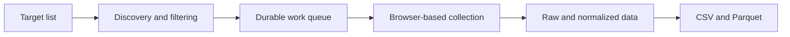

Extracting data from a chart initially looked like a short automation task. Open the page, sign in, read the points, and write them to a file. My first working prototype did exactly that. Once the number of targets grew, however, parsing stopped being the hard part. Pagination missed records, long runs crossed into the next day, interrupted jobs became stuck in the queue, and one malformed record could terminate the entire process.

For this project, I built a resilient pipeline that collects time-series data visible to my authorized session in a web interface. I will not identify the service, disclose private endpoints, reproduce service-specific parameters, or describe ways to defeat its protections. Instead, this post focuses on engineering decisions that transfer to other long-running scrapers: separating discovery from collection, making work durable, retrying idempotently, preserving raw input, and reporting progress that an operator can actually trust.

## Why the First Prototype Was Not Enough

The earliest flow was linear: open a target, find its history, enter a qualifying record, and save the chart. It worked on a small sample. At realistic volume, I discovered that the interface exposed only the first group of results. “I can see twenty records” did not mean “I have found every eligible record.”

Adding pagination was not enough by itself. The main view showed a shortened preview rather than the complete history. The forward control appeared only after expanding the full list, and the default date range did not always cover the window I needed. That changed how I thought about browser automation. The first HTML snapshot is not necessarily the complete data source; interface transitions—expanding a list, selecting a time window, and advancing a page—need to be modeled as explicit behavior.

Authentication introduced another layer of uncertainty. Without a valid session, the chart could arrive at lower resolution, and a session might expire halfway through a long run. A successful page load therefore was not sufficient proof of success. I also had to verify that the resulting data had the expected resolution. Temporary protection screens received patient, bounded retries rather than an endless loop. The automation was designed to manage failures in an authorized flow, not to bypass access controls.

## Separating Discovery from Collection

The most valuable architectural decision was splitting one large loop into two stages. **Discovery** decides which records should be processed. It walks the paginated history, applies configurable age and duration rules, and writes links and summary metadata to a local database. **Collection** opens only queued records and stores their detailed time series and related events.

This separation solved several problems at once. Re-running discovery does not enqueue records that are already complete. Changing a filter can update the candidate set without reopening every detail page. If collection stops, it can resume from the existing queue without repeating discovery.

Each job has one of five states: `pending`, `scraping`, `done`, `failed`, or `skipped`. A skipped record is not discarded. Its link and summary remain available, but its detailed chart is not collected. That leaves an auditable answer to “why was this record not processed?”—it may have fallen outside the age window, missed the duration threshold, or no longer belonged to the target list.

<Callout label="Core decision">
Discovery is a selection problem; scraping is an execution problem. Combining both in one loop makes retries and data integrity harder than they need to be.
</Callout>

## Resuming Long Runs Safely

A queue containing hundreds of jobs can run for hours. Stopping it manually is not an exceptional event; it is a normal operating mode. My initial design marked a job as `scraping` before opening its page. If the process stopped at that moment, the job remained in that state forever because the next run selected only `pending` and `failed` records.

I fixed this with two recovery paths. First, startup requeues `scraping` records that have not been updated for a configurable amount of time. Second, an explicit command lets the operator immediately return all interrupted jobs to `pending`. The stale timeout matters because it prevents one process from reclaiming work that another process may still be actively handling.

Database failures exposed a subtler bug. When two points shared the same timestamp, a uniqueness constraint rejected the insert and rolled back the transaction. The session was then reused without an explicit rollback, so the next exception hid the original cause behind a transaction-state error. The repair had three parts: deduplicate points by timestamp, flush deletions before inserting replacements, and roll back the session on every exception path.

After those changes, rerunning a job became safe. Old detail rows are replaced deliberately, completed jobs are not collected twice, and repeated execution converges on the same result. For a long-running pipeline, idempotency—the ability to repeat an operation without corrupting its outcome—proved more valuable than a small speed improvement.

## The Technology Stack and Data Layers

Python is the backbone of the project. For browser control, I used `invisible_playwright`, which preserves the standard Playwright interface. The library provides a source-patched Firefox engine and a consistent browser profile per session. Browser fingerprint fields such as screen characteristics, graphics capabilities, fonts, and related signals are generated at the engine layer rather than added later through JavaScript overrides. Mouse paths and click timing are also humanized inside the driver. This let me keep most of the familiar Playwright workflow while running a real browser session with fewer obvious automation artifacts.

In headless mode, the browser runs on a virtual display. During local development, I could launch the same flow in a visible window, which made session and interface failures much easier to diagnose. Persisting browser state also prevented the pipeline from signing in again before every record.

“Getting past bot protection” did not mean exploiting a vulnerability or disabling a verification mechanism. `invisible_playwright` made the browser fingerprint and interactions look closer to an ordinary session, while the application continued to operate through my authorized account. When a protection screen appeared, the scraper did not secretly solve it: it waited, retried a bounded number of times, and recorded a failure if access remained unavailable. The library is not a universal guarantee either; session validity and network reputation still affect the result.

SQLAlchemy and SQLite form the persistence layer. SQLAlchemy makes state transitions and relationships explicit, while a single-file SQLite database keeps operational overhead low for long local runs. Pandas and PyArrow produce CSV and Parquet outputs. Tenacity provides bounded retries, Click defines the command-line interface, Rich renders the live progress line, and YAML plus dotenv handle configuration. Pytest verifies parsing, filtering, deduplication, and recovery behavior without launching a browser.

### Raw and Normalized Data

Normalized tables are convenient for analysis, but they are not enough when a parser needs to be corrected later. I therefore keep a raw copy of every successful source response. If the shape changes, I can run a new parser over existing files without opening the browser again.

The normalized layer contains two types of data. The first is a time series of audience and interaction measurements. The second is a set of events that can explain abrupt changes in the chart. An inbound audience transfer, for example, may account for a jump that would otherwise look like organic growth. Storing events in their own table supports multiple events per session without forcing them into a handful of columns.

Session-level summaries remain on the main record. This keeps broad filtering inexpensive while detailed points stay in a separate long table. The export step produces independent CSV and Parquet datasets for sessions, time-series points, and events. That layout works well for analysis because summary-level questions and time-dependent questions rarely need the same table shape.

Keeping both raw and normalized data costs disk space. In return, it provides reproducibility: I can trace an analysis result back to the source file and the parser rules that produced it. That trade-off is particularly useful when the upstream interface can evolve independently of my code.

## Making Progress Visible

The first full-scale scraping run took roughly 12 hours. At the end of that run, the working snapshot occupied about **335 MiB** across raw files and the local database. It contained 1,391 raw response files, more than **1.16 million normalized records**, and a few thousand event rows. This is not an enormous dataset by modern standards, but it is large enough—when collected by one long-running, reproducible process—to make queue management and fault tolerance necessary rather than optional.

When a scraper stays quiet for several minutes, it is difficult to tell whether it is working, waiting, or stuck on the same record. My first response was to print a new terminal line for every event. That created the opposite problem: overall progress disappeared inside hundreds of log messages.

The final design keeps ordinary logs scrolling upward while one live status line stays at the bottom. It shows the active target, completed work for the current group, global remaining jobs, success and failure counts, and elapsed time. Interactive terminals receive the live progress bar; environments where ANSI behavior is unreliable fall back to plain logs.

One implementation detail was surprisingly important. Different modules had created separate terminal console objects, so protection-screen warnings were printed beside the live bar instead of above it. Sharing a single console across the application restored correct rendering. I also changed repeated warnings from one message every few seconds to one message per waiting period.

Observability here is more than decorative terminal output. Recording duration per job provides a rough estimate of remaining time. A rising failure rate can reveal a systemic session or schema problem before the entire queue is affected. The operator sees not only that the process is alive, but whether it is making meaningful progress.

## Managing Fragility Instead of Pretending It Is Gone

Browser-based collection is never a permanently stable integration. A button label may change, a table may become a preview, a session may expire, or a response may gain a new field. I started treating the scraper as a small data product that can diagnose change rather than a one-off script that happens to work today.

Keeping fragile responsibilities separate helped. Selectors and pagination behavior live in discovery; time-series normalization lives in the parser; persistence belongs to the database layer. An interface change should not require changes to export code, and a new database column should not alter browser behavior. Backward-compatible normalization and idempotent schema migration also preserve data from older runs.

This architecture makes the security boundary explicit. The system collects only data available to my authorized account and uses measured intervals between requests. It does not contain a technique for disabling protection mechanisms. It waits, retries a bounded number of times, and records a failure when access is unavailable. Resilience and persistence are not the same as unlimited insistence.

## Conclusion

Reading numbers from a chart was not the difficult part of this project. The real work was finding every eligible record, carrying a long queue across interruptions, and preventing one bad input from invalidating the run. Separating discovery from collection, storing state in a durable database, and preserving raw input turned a disposable script into a repeatable data pipeline.

Today, adding a target updates the discovery queue and collection processes only selected work. I can stop the run, resume it the next day, and handle duplicate or malformed points without damaging completed data. The next improvements are to estimate completion time from historical throughput and add small contract tests that detect interface changes before they spread through the queue.
