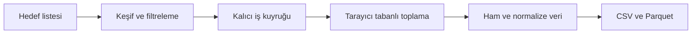
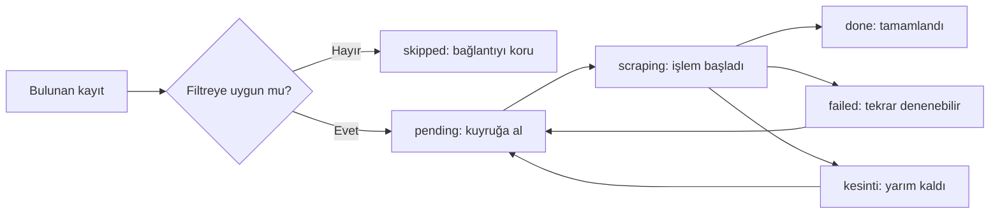
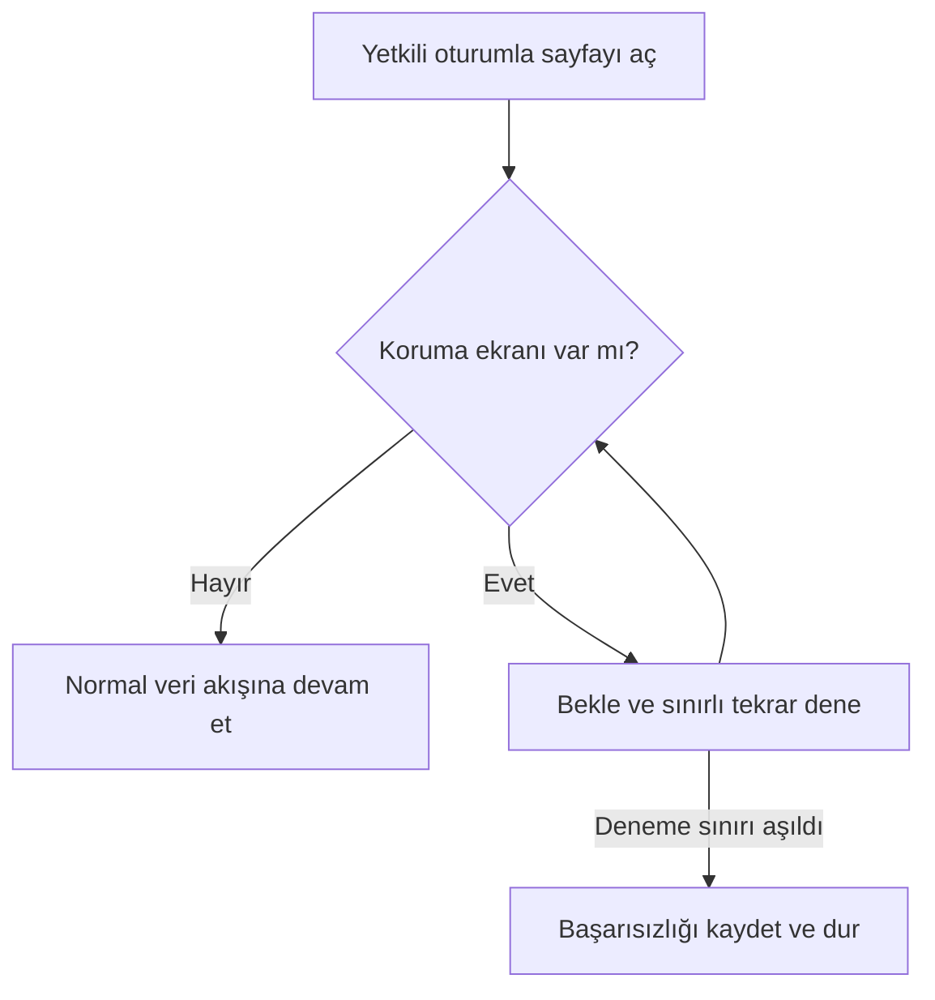
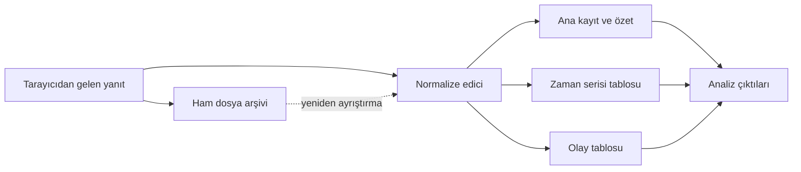
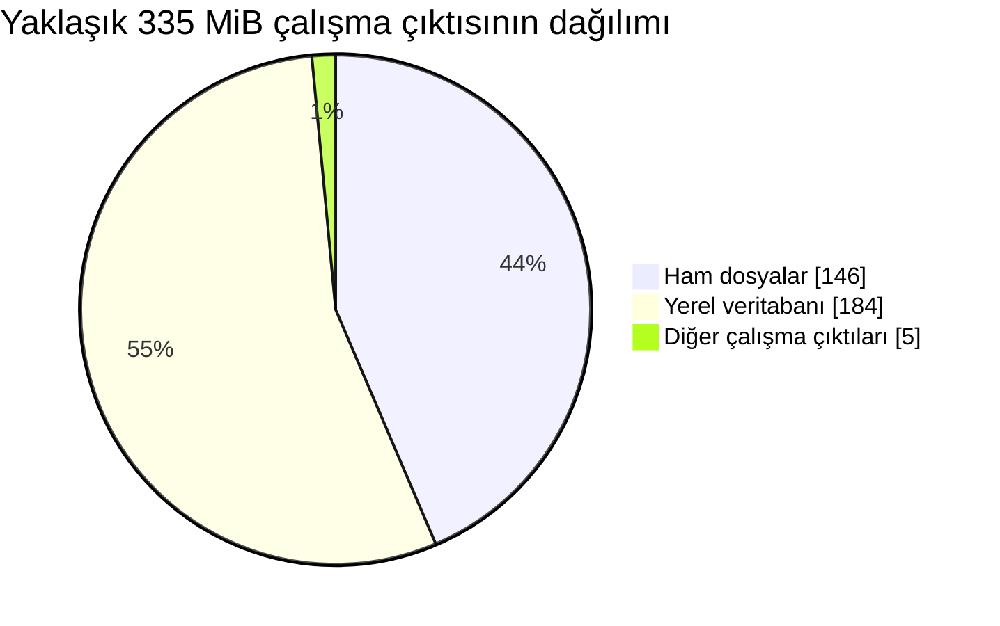

Bir grafikten veri almak ilk bakışta kısa bir otomasyon işi gibi görünüyordu. Sayfayı açacak, oturum açacak, noktaları okuyacak ve dosyaya yazacaktım. İlk çalışan prototip de tam olarak bunu yaptı. Fakat hedef sayısı arttığında sorun veri ayrıştırmaktan çıktı: sayfalama eksik kalıyor, uzun koşular ertesi güne sarkıyor, yarıda kesilen işler kuyrukta takılıyor ve tek bir bozuk kayıt bütün süreci durdurabiliyordu.

Bu projede zaman serisi sunan bir web arayüzünden, yalnızca yetkili oturumumun görebildiği verileri toplamak için dayanıklı bir veri hattı kurdum. Burada sitenin adını, özel uç noktalarını veya koruma mekanizmalarını aşmaya yönelik ayrıntıları paylaşmayacağım. Bunun yerine uzun süre çalışan scraper’larda tekrar kullanılabilecek mühendislik kararlarına odaklanacağım: keşif ile toplamayı ayırmak, işi kalıcı hâle getirmek, aynı veriyi güvenle yeniden işlemek ve terminalde gerçek ilerlemeyi göstermek.

## İlk Prototip Neden Yeterli Değildi?

İlk sürümde akış doğrusaldı: hedef sayfayı aç, yayın geçmişini bul, uygun görünen kayda gir ve grafiği kaydet. Küçük bir örnekte bu yaklaşım başarılıydı. Gerçek hacme geçtiğimde ise arayüzün yalnızca ilk grup sonucu gösterdiğini fark ettim. “Yirmi kayıt gördüm” ile “eldeki bütün uygun kayıtları gördüm” aynı şey değildi.

Sayfalama da tek başına çözüm olmadı. Ana görünüm, tam geçmiş yerine kısaltılmış bir önizleme sunuyordu. Tam listeye geçmeden ileri düğmesi görünmüyor; dönem seçimi de aradığım tarih penceresini her zaman kapsamıyordu. Bu durum bana tarayıcı otomasyonunda ekrandaki ilk HTML’nin veri kaynağının tamamı olmadığını gösterdi. Arayüzün durum geçişlerini —listeyi genişletme, tarih aralığını seçme ve sonraki sayfaya ilerleme— ayrı davranışlar olarak modellemek gerekiyordu.

Bir başka sorun da oturumdu. Giriş yapılmadığında veri daha seyrek geliyor, uzun bir koşunun ortasında oturum geçerliliğini kaybedebiliyordu. Bu yüzden “sayfa açıldı mı?” kontrolü yeterli değildi; beklenen çözünürlükte veri gelip gelmediğini de doğrulamak zorundaydım. Koruma ekranları için sabırlı bekleme ve sınırlı tekrar deneme ekledim, fakat başarısızlığı sonsuz döngüye çevirmedim. Otomasyonun görevi erişim kontrolünü aşmak değil, izinli akışın geçici sorunlarını yönetmekti.

## Keşif ile Toplamayı Ayırmak

En etkili mimari karar, tek büyük döngüyü iki aşamaya bölmek oldu. **Keşif** aşaması yalnızca hangi kayıtların işlenmesi gerektiğini belirliyor. Sayfalı geçmişi geziyor, yapılandırılabilir yaş ve süre eşiklerini uyguluyor, bulunan kayıtların bağlantılarını ve özet bilgilerini yerel veritabanına yazıyor. **Toplama** aşaması ise yalnızca kuyruktaki işleri açıp ayrıntılı zaman serisini ve ilişkili olayları kaydediyor.

Bu ayrım birkaç sorunu aynı anda çözdü. Keşfi yeniden çalıştırdığımda daha önce tamamlanmış kayıtlar tekrar kuyruğa girmiyor. Filtre eşiğini değiştirdiğimde bütün ayrıntı sayfalarını yeniden açmadan aday listesini güncelleyebiliyorum. Toplama süreci durursa keşfi tekrarlamak zorunda kalmadan kaldığı kuyruktan devam ediyor.

Her işin durumu `pending`, `scraping`, `done`, `failed` veya `skipped` olarak tutuluyor. `skipped`, kaydın kaybolduğu anlamına gelmiyor: bağlantı ve özet bilgi korunuyor, fakat ayrıntılı grafik işlenmiyor. Böylece “neden alınmadı?” sorusuna yaş, süre veya hedef listesinden çıkarılma gibi somut bir yanıt verebiliyorum.

<Callout label="Temel karar">
  Keşif bir seçim problemi, scraping ise bir yürütme problemidir. İkisini aynı
  döngüde çözmeye çalışmak hem tekrar denemeyi hem de veri bütünlüğünü
  zorlaştırır.
</Callout>

## Uzun Koşularda Devam Edebilmek

Yüzlerce iş içeren bir kuyruk saatler sürebiliyor. Bu noktada Ctrl+C ile durdurmak istisna değil, normal bir kullanım biçimi. İlk tasarımda iş başlamadan önce durumunu `scraping` yapıyordum. Süreç o anda kapanırsa kayıt bu durumda kalıyor ve bir sonraki çalıştırma yalnızca `pending` ile `failed` kayıtları aldığı için iş sonsuza kadar unutuluyordu.

Bunu iki katmanlı bir kurtarma mekanizmasıyla düzelttim. Birincisi, uzun süredir güncellenmemiş `scraping` kayıtlarını başlangıçta tekrar `pending` durumuna alan otomatik kurtarma. İkincisi, kullanıcıya bütün yarım işleri anında kuyruğa döndüren açık bir komut sunmak. Zaman aşımı, eş zamanlı çalışan başka bir sürecin aktif işini yanlışlıkla sahiplenmemek için gerekliydi.

Veritabanı hataları daha sinsi bir problem çıkardı. Aynı zaman damgasına sahip iki nokta benzersizlik kısıtını ihlal ettiğinde işlem geri alınıyor, fakat oturum rollback yapılmadan kullanılmaya devam ediliyordu. Sonraki hata mesajı gerçek nedeni gizleyen bir “işlem geri alınmalı” hatasına dönüşüyordu. Çözüm üç parçalıydı: noktaları zaman damgasına göre tekilleştirmek, eski satırları silip eklemeden önce işlemi flush etmek ve her exception yolunda oturumu açıkça rollback etmek.

Bu değişikliklerden sonra tekrar çalıştırmak tehlikeli olmaktan çıktı. Aynı iş ikinci kez denenebilir; eski ayrıntı satırları kontrollü biçimde değiştirilir; tamamlanan kayıt yeniden işlenmez. İdempotency —aynı işlemi tekrar yaptığımızda sonucun bozulmaması— uzun koşular için hız optimizasyonundan daha değerliydi.

## Teknoloji Yığını ve Veri Katmanları

Projenin omurgasını Python oluşturuyor. Tarayıcı kontrolünde standart Playwright arayüzünü koruyan `invisible_playwright` kullandım. Bu kütüphane, kaynak kod düzeyinde değiştirilmiş bir Firefox motoru ve oturum başına tutarlı bir tarayıcı profili sağlıyor; ekran, grafik yetenekleri, yazı tipleri ve benzeri parmak izi alanlarını sayfaya sonradan JavaScript yaması enjekte etmek yerine motor katmanında üretiyor. Fare hareketleri ve tıklama zamanlamaları da sürücünün içinde daha doğal bir akışla oluşturuluyor. Böylece mevcut Playwright kodunu büyük ölçüde değiştirmeden, otomasyon izlerini azaltan gerçek bir tarayıcı oturumu çalıştırabildim.

Headless koşularda tarayıcı sanal bir ekran üzerinde çalışıyor. Yerel geliştirmede aynı akışı görünür pencereyle açmak, oturum ve arayüz sorunlarını teşhis etmeyi kolaylaştırdı. Oturum bilgisi kalıcı tarayıcı durumu olarak saklandığı için her kayıt öncesinde yeniden giriş yapılmıyor.

“Bot korumasını aşmak” burada bir güvenlik açığı kullanmak veya doğrulama mekanizmasını devre dışı bırakmak anlamına gelmiyor. `invisible_playwright`, otomasyonun tarayıcı parmak izini ve etkileşimlerini sıradan bir oturuma yaklaştırdı; uygulama ise benim yetkili hesabımın normal akışı içinde çalıştı. Bir koruma ekranı geldiğinde scraper bunu gizlice çözmeye çalışmıyor: bekliyor, sınırlı sayıda yeniden deniyor ve erişim sağlanamazsa işi başarısız olarak kaydediyor. Kütüphane de tek başına geçiş garantisi vermiyor; oturumun geçerliliği ve ağın itibarı hâlâ sonucu etkiliyor.

Kalıcılık katmanında SQLAlchemy ve SQLite var. SQLAlchemy durum geçişlerini ve ilişkileri modellemeyi kolaylaştırırken tek dosyalı SQLite kurulumu uzun yerel koşular için operasyonel yükü düşük tuttu. Pandas ve PyArrow, tamamlanan veriyi CSV ve Parquet biçimlerine taşıyor. Tenacity sınırlı tekrar denemeleri, Click komut satırı arayüzünü, Rich canlı ilerleme satırını, YAML ile dotenv ise yapılandırmayı yönetiyor. Pytest testleri de ayrıştırma, filtreleme, tekilleştirme ve kurtarma davranışlarını tarayıcı açmadan doğruluyor.

### Ham ve Normalize Veri

Yalnızca normalize edilmiş tabloyu saklamak hızlı analiz için iyi, fakat ayrıştırıcıdaki bir hatayı sonradan düzeltmek için yetersizdi. Bu yüzden her başarılı toplamada kaynak yanıtın ham bir kopyasını da tutuyorum. Şema değişirse tarayıcıyı yeniden çalıştırmadan eski dosyaları yeni ayrıştırıcıyla işleyebilirim.

Normalize katmanda iki farklı veri türü var. Birincisi, izleyici ve etkileşim ölçümlerini belirli zaman damgalarıyla saklayan zaman serisi. İkincisi, grafikteki ani değişimleri açıklayabilen olay kayıtları. Örneğin dışarıdan gelen bir izleyici aktarımı, tek başına organik büyüme gibi görünen sıçramayı açıklayabiliyor. Olayları ana tabloya birkaç sütun sıkıştırmak yerine ayrı bir tabloya koymak, bir yayına birden fazla olay bağlamayı kolaylaştırdı.

Özet metrikler ise ana iş kaydında kalıyor. Bu sayede ayrıntılı noktaları açmadan yayın düzeyinde filtreleme yapılabiliyor. Dışa aktarım aşaması ana kayıtları, zaman serisini ve olayları ayrı CSV ve Parquet dosyaları olarak üretiyor. Böyle bir ayrım, veri bilimi tarafında geniş özet tablo ile uzun zaman serisi tablosunu farklı amaçlarla kullanmamı sağladı.

Ham ve normalize veriyi birlikte tutmanın maliyeti disk alanı. Buna karşılık tekrar üretilebilirlik kazancı daha büyük: bugün verdiğim bir analiz sonucunun hangi kaynak dosyadan ve hangi ayrıştırma kurallarıyla geldiğini izleyebiliyorum.

## İlerlemeyi Gerçekten Görmek

İlk tam ölçekli scraping koşusu yaklaşık 12 saat sürdü. Koşu sonundaki anlık görüntü, ham dosyalar ve yerel veritabanıyla birlikte yaklaşık **335 MiB** disk alanı kaplıyordu. Bu hacimde 1.391 ham yanıt dosyası, **1,16 milyondan fazla normalize kayıt** ve birkaç bin olay satırı vardı. Tek başına devasa bir veri kümesi değil; fakat tek süreçte, uzun süre ve tekrar üretilebilir biçimde toplandığında kuyruk yönetimi ile hata toleransını zorunlu kılacak kadar büyük.

Uzun bir scraper sessiz kaldığında çalışıyor mu, bekliyor mu, yoksa aynı kayıtta takıldı mı anlamak zor. Başta her olay için terminale yeni bir satır yazdırıyordum. Bu kez de yüzlerce satır arasında toplam ilerleme kayboldu. Çözüm, normal logları yukarı akıtırken terminalin altında tek bir canlı ilerleme satırı tutmak oldu.

Bu satır aktif hedefi, yayıncı bazında tamamlanan iş sayısını, global kalan işi, başarılı ve başarısız sonuçları ve geçen süreyi gösteriyor. Etkileşimli terminalde canlı bar kullanılıyor; ANSI davranışının güvenilir olmadığı CI ortamında düz loglara geri dönülüyor.

Uygulamada beklemediğim bir ayrıntı çıktı: farklı modüller ayrı terminal nesneleri oluşturduğunda koruma ekranı mesajları canlı barın yanına yapışıyordu. Bütün modülleri ortak bir konsol örneğinde birleştirince loglar barın üstünde düzgün biçimde akmaya başladı. Aynı tekrarlanan uyarıyı birkaç saniyede bir yazmak yerine, her bekleme dönemi için yalnızca bir kez gösterdim.

Gözlemlenebilirlik yalnızca estetik bir terminal çıktısı değil. Hangi işin ne kadar sürdüğünü veritabanına yazmak, kalan sürenin kabaca tahmin edilmesini; hata oranının artması ise oturum veya şema değişikliği gibi sistemik bir sorunun erken fark edilmesini sağlıyor.

## Kırılganlığı Yönetmek

Tarayıcı tabanlı veri toplama hiçbir zaman tamamen sabit bir entegrasyon değil. Düğme metni değişebilir, tablo önizlemeye dönüşebilir, oturum sona erebilir veya yanıt şeması yeni bir alan kazanabilir. Bu yüzden sistemi “bir kez çalışan script” olarak değil, değişiklikleri teşhis edebilen küçük bir veri ürünü olarak ele aldım.

Kırılgan parçaları sınırlandırmak burada önemliydi. Seçiciler ve sayfalama davranışı keşif modülünde; zaman serisi normalizasyonu ayrıştırıcıda; kalıcılık ise veritabanı katmanında kaldı. Bir arayüz değişikliği olduğunda export koduna, bir kolon eklendiğinde tarayıcı davranışına dokunmam gerekmiyor. Birkaç şema için geriye uyumlu normalizasyon ve mevcut veritabanına idempotent kolon ekleme de eski veriyi korudu.

Bu yaklaşım güvenlik sınırını da netleştiriyor. Sistem yalnızca benim erişim hakkım bulunan görünür veriyi, ölçülü istek aralıklarıyla topluyor. Koruma mekanizmasını etkisizleştirmeye yönelik bir teknik içermiyor; bekliyor, sınırlı sayıda yeniden deniyor ve erişim sağlanamazsa başarısızlığı kaydediyor. Dayanıklılık ile ısrarcılık aynı şey değil.

## Sonuç

Projenin zor kısmı grafikten sayı okumak değildi. Gerçek iş; hangi kayıtların işleneceğini güvenilir biçimde bulmak, uzun kuyruğu kesintilerden sonra sürdürebilmek ve bir hata olduğunda bütün süreci kaybetmemekti. Keşif ile toplamayı ayırmak, durumları kalıcı bir veritabanında tutmak ve ham veriyi saklamak scraper’ı tek kullanımlık bir betikten tekrar çalıştırılabilir bir veri hattına dönüştürdü.

Bugün yeni bir hedef eklediğimde önce keşif kuyruğu güncelliyor, ardından toplama yalnızca seçilmiş işleri işliyor. Süreci durdurup ertesi gün devam ettirebiliyor, eksik veya yinelenen noktaları veri bütünlüğünü bozmadan yönetebiliyorum. Bir sonraki adım, süre tahminini geçmiş çalışma hızından otomatik hesaplamak ve arayüz değişikliklerini küçük sözleşme testleriyle daha erken yakalamak.
