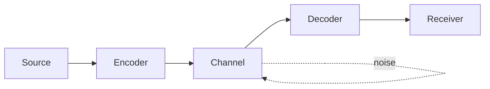

In 1948, Claude Shannon's *A Mathematical Theory of Communication* showed that
"information" could be defined as a mathematical quantity. Here I build up what
entropy measures, both intuitively and formally.

<Definition label="Shannon Entropy">
  Let $X$ be a discrete random variable with probability mass function $p(x)$.
  The **Shannon entropy** of $X$ (in bits) is

  $$H(X) = -\sum_{x \in \mathcal{X}} p(x) \log_2 p(x)$$

  where $0 \log 0 = 0$ by convention.
</Definition>

## Entropy as uncertainty

Entropy is the *average uncertainty* before observing an outcome. For a fair coin
$H = 1$ bit; for a two-headed coin $H \approx 0$ bits. The uniform distribution
gives the maximum uncertainty:

$$H(X) \le \log_2 |\mathcal{X}|$$

with equality only when the distribution is uniform. This is the essence of the
*maximum entropy principle*.

<Theorem label="Asymptotic Equipartition Property (AEP)">
  Let $X_1, X_2, \dots$ be i.i.d. Then the probability of a typical sequence is
  approximately $2^{-nH(X)}$ and the size of the typical set is approximately
  $2^{nH(X)}$.
</Theorem>

The AEP is the load-bearing result for compression and channel coding: we can
compress a length-$n$ sequence to roughly $nH(X)$ bits and recover it.

## The flow of a channel

The diagram below shows the essential components of the path from source to sink:



## A quick computation in Python

The entropy of a non-uniform distribution is a few lines away:

```python
import numpy as np

def entropy(p: np.ndarray) -> float:
    p = p[p > 0]
    return float(-np.sum(p * np.log2(p)))

p = np.array([0.5, 0.25, 0.125, 0.125])
print(entropy(p))  # 1.75 bits
```

<Callout>
This example is deliberately small. Cross-entropy and KL divergence — natural
extensions of entropy that show up everywhere in ML, from classification loss to
variational inference — are the topic of the next post.
</Callout>
