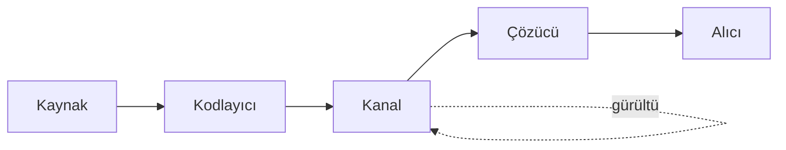

1948'de Claude Shannon, *A Mathematical Theory of Communication* adlı çalışmasıyla
"bilginin" matematiksel bir nicelik olarak tanımlanabileceğini gösterdi. Bu yazıda
entropinin neyi ölçtüğünü sezgisel ve matematiksel olarak kuracağım.

<Definition label="Shannon Entropisi">
  $X$ ayrık bir rastgele değişken, $p(x)$ olasılık kütle fonksiyonu olsun. $X$'in
  **Shannon entropisi** (bit cinsinden)

  $$H(X) = -\sum_{x \in \mathcal{X}} p(x) \log_2 p(x)$$

  olarak tanımlanır. Burada $0 \log 0 = 0$ kabul edilir.
</Definition>

## Belirsizlik olarak entropi

Entropi, bir sonuç gözlemlemeden önceki *ortalama belirsizliğidir*. Düz bir para
için $H = 1$ bit; iki taraflı madeni para için $H \approx 0$ bit. Düzgün dağılım
maksimum belirsizliği verir:

$$H(X) \le \log_2 |\mathcal{X}|$$

eşitlik ancak dağılım düzgün olduğunda sağlanır. Bu, *maksimum entropi prensibinin*
özüdür.

<Theorem label="Asimptotik Eşbölütleme (AEP)">
  $X_1, X_2, \dots$ bağımsız ve özdeş dağılımlı olsun. O zaman tipik dizilerin
  olasılığı yaklaşık olarak $2^{-nH(X)}$'dir ve tipik kümenin boyutu yaklaşık
  $2^{nH(X)}$'dir.
</Theorem>

AEP, sıkıştırma ve kanal kodlamasının taşıyıcı sonucudur: $n$ uzunluğundaki bir
diziyi ortalama $nH(X)$ bit'e sıkıştırabilir ve geri yükleyebiliriz.

## Bir kanalın akışı

Aşağıdaki diyagram, kaynaktan alıcıya giden yolun temel bileşenlerini gösterir:



## Python'da hızlı bir hesap

Düzgün olmayan bir dağılımın entropisini birkaç satırda hesaplayabiliriz:

```python
import numpy as np

def entropy(p: np.ndarray) -> float:
    p = p[p > 0]
    return float(-np.sum(p * np.log2(p)))

p = np.array([0.5, 0.25, 0.125, 0.125])
print(entropy(p))  # 1.75 bit
```

<Callout>
Bu örnek bilinçli olarak küçük tutuldu. Çapraz entropi ve KL ıraksaması, sınıflandırma
kaybından variational inference'a kadar ML'in her yerinde karşımıza çıkan
entropinin doğal genişlemeleridir; bunlara bir sonraki yazıda değineceğim.
</Callout>
