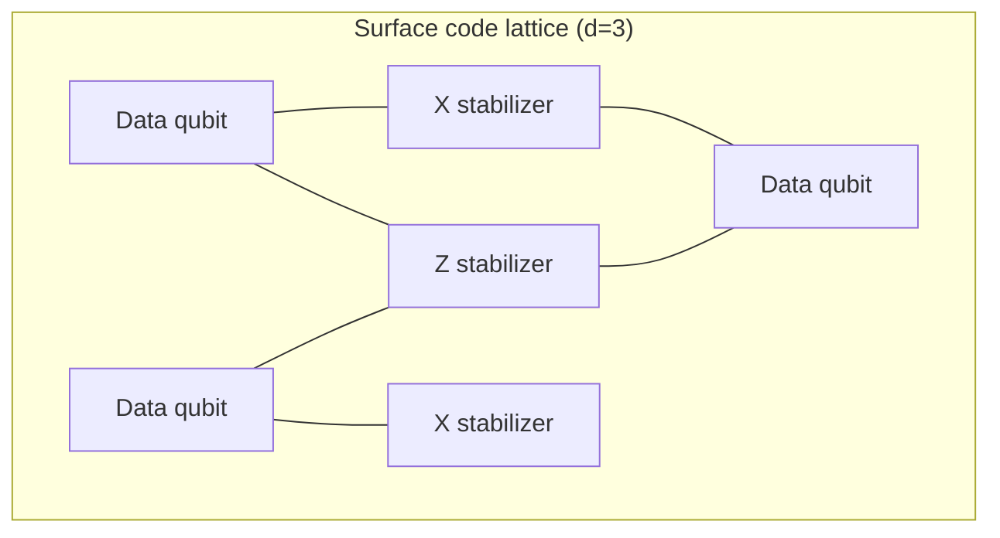

The central challenge of quantum computing: quantum states lose coherence fast.
The surface code places data and measurement qubits on a 2D lattice and detects
errors through *stabilizer measurements*.

## The stabilizer formalism

A $[[n,k,d]]$ stabilizer code encodes $k$ logical qubits into $n$ physical qubits.
For the surface code $k=1$, and the code distance $d$ sets the lattice size. The
stabilizer group is an abelian subgroup:

$$S = \langle S_1, S_2, \dots, S_{n-k} \rangle, \qquad S_i \in \{X, Z\}^{\otimes n}$$

## Lattice geometry

The diagram below shows the lattice structure of the surface code and the
placement of $X$/$Z$ stabilizer measurements:

<Callout>
The surface code requires gates only between *neighboring* qubits, which makes it
one of the most hardware-realistic quantum codes from a connectivity standpoint.
</Callout>
