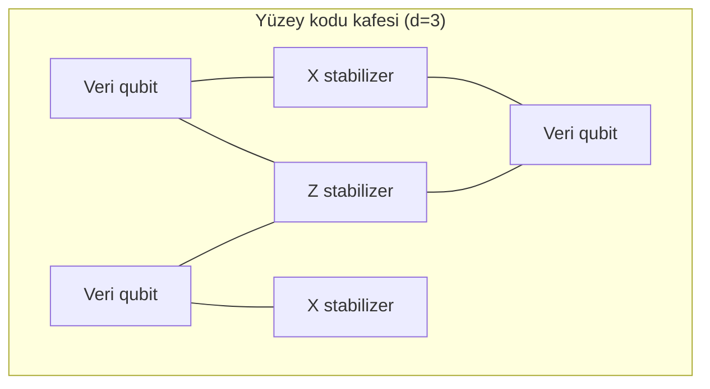

Kuantum bilgisayarların temel zorluğu: kuantum durumlar koheransını hızla yitirir.
Yüzey kodu, veri ve ölçü qubit'lerini iki boyutlu bir kafese yerleştirerek hataları
*stabilizer ölçümleriyle* tespit eder.

## Stabilizer formalizmi

Bir $[[n,k,d]]$ stabilizer kodu, $n$ fiziksel qubit'ten $k$ mantıksal qubit üretir.
Yüzey kodu için $k=1$'dir ve kod mesafesi $d$ kafes boyutunu belirler. Stabilizer
grubu, $S$ abelyen altgrubudur:

$$S = \langle S_1, S_2, \dots, S_{n-k} \rangle, \qquad S_i \in \{X, Z\}^{\otimes n}$$

## Kafes geometrisi

Aşağıdaki diyagram, yüzey kodunun kafes yapısını ve $X$/$Z$ stabilizer ölçümlerinin
yerleşimini gösterir:

<Callout>
Yüzey kodu, yalnızca *komşu* qubit'ler arasında geçit gerektirir; bu, donanım
bağlanabilirliği açısından onu en gerçekçi kuantum kodlarından biri yapar.
</Callout>
